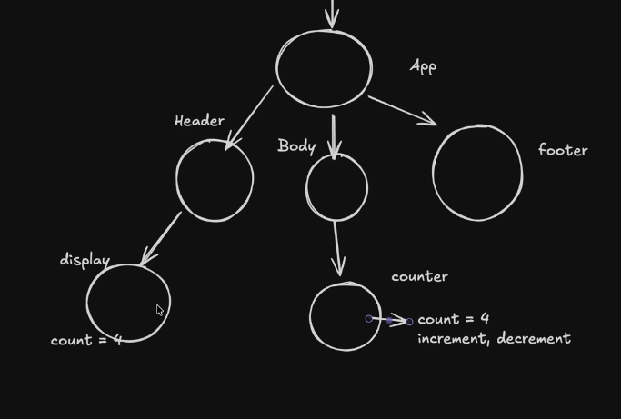
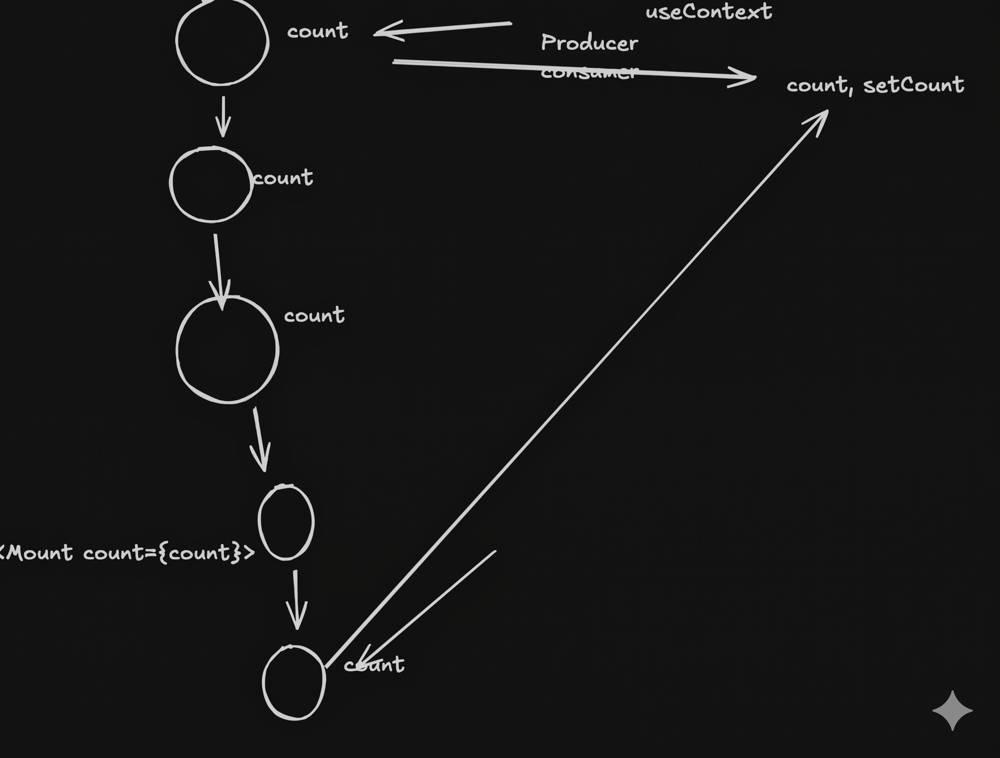
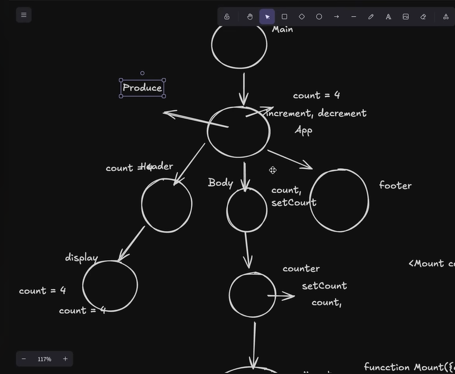

#Problem:
Suppose there are four components:

Description: I want to use the state variable across the components.
Note: Parent can pass the context through props but, how it will pass the same to its siblings.

Problem of prop drilling:

Solution: 
The concept of state Lifting.
we have two files App.jsx and Counter.jsx;
we have [count,setCount] in Counter.jsx;

so to pass the [count,setCount] to Display.jsx, we need to lift the state and therefore should use the [count,setCount] in the App.jsx.  

useContext is used to pass the context across components without going into the mesh of the Prop drilling.
Whenever we use the state lifting the immediate child of the <Counter>(original owner of[set,setCount]) would recieve these as props after re-rendering of the intermediate components(which may be using {count,setCount} as parameters, but not using it inside the function, it is passing these props downward and not extracting out of it). These re-rendering is waste.

InShort state lifting cause too deep prop drilling.
Usecontext uses the concept of Producer and consumer, where producer produce these state [count,setCount] and consumer(or, components use it at demand).

Ultimate Solution:
1.// create context in the App.jsx and export it:

export const CreateContext = createContext();

//and wrap the all other components inside it:
2. <CounterContext value={{count,setCount}}>
      <Header count={count}/>
      <Body count={count} setCount={setCount}/>
      <Footer/>
</CounterContext>

To use the value of the count and setCount in the Display and counter.
Impot useContext and ContextCreator.

3. const {count,setCount} = useContext(ContextCreator);

This would provide "Producer" in the body component as follows:

----------------------------------------------------------------------------
----------------------------------------------------------------------------

# Section-C:

