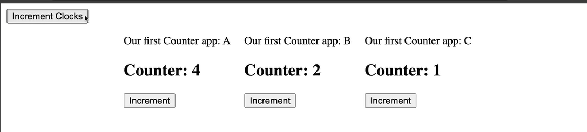
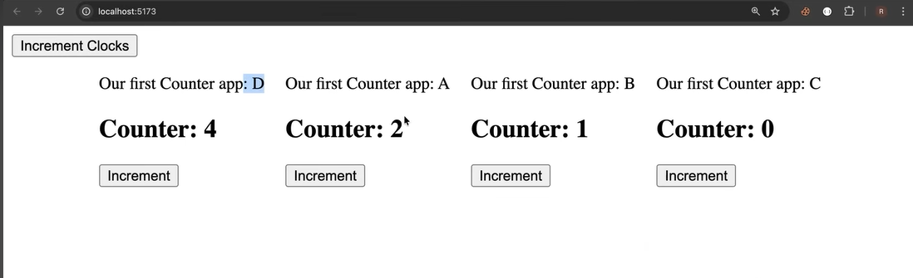
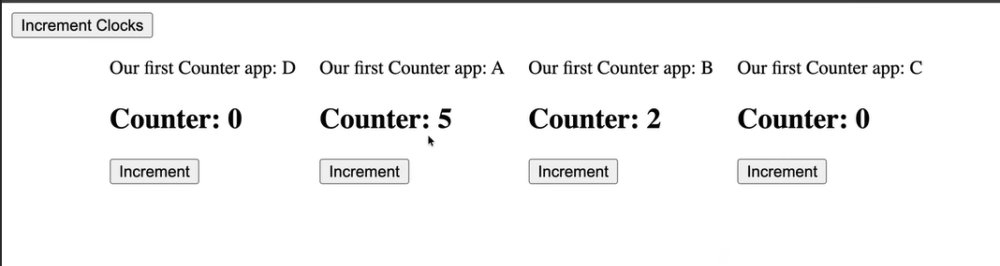

//Problem:
Before clicking Increment Button:

After clicking:

Issue due to missing use of the unique key
without key: My code

            {clocks.map(clock => <counting name={clock}></counting>)}

With Key:

            {clocks.map(clock => <counting key={clock} name={clock}></counting>)}

Result:
