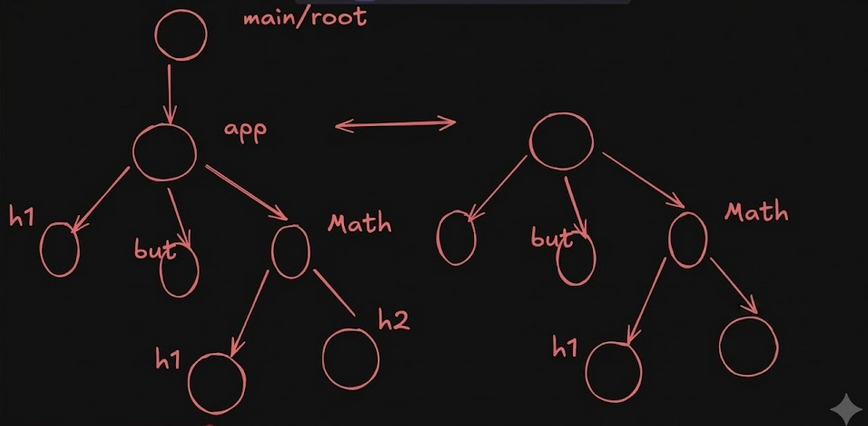
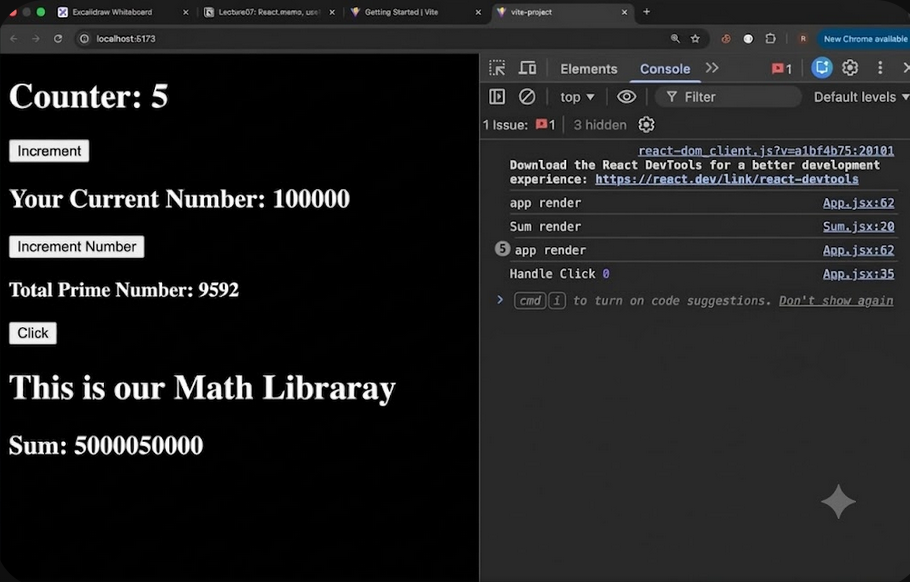

Problem:
1. We have two jsx files namely Sum.jsx and App.jsx 
2. Whenever App function is rendered, it also rendered sum function.
3. Issue: count state variable is not impacting h1 and h2 tag of sum function.
But, while a vdom tree h1 and h2 tag of the </Sum> is also rerendered.
4. Description: why should h1 and h2 child  of </Sum> should be rerendered and can't be used from old vdom tree in new 
vdom tree instead? What can be done to prevent the component although in same block (<>...</>) but are totally independent from each other.
Note: count state variable is used in the Increment button only.

Solution: Use React.Memo
Syntax:
const Sum = React.Memo(()=>{
    function Sum(){.....}
})

5. How ReactMemo works?
-->It compare the new and old state with the help of the "props" value. if constant value is passed , react memo will not render h1 and h2 element because this elements are still not changing as value being passed in each rendering is constant.
Conclusion: ReactMemo --> Child only re-renders when props actually changes.

6. useMemo remembers values and useCallback remember functions.
while ReactMemo just avoid rendering of the components/elements that does not show any change in props.

7. see the reference:

8. Remember that whenever object is passed as props, they are compared with respect to the reference.
So, whenever app re-renders, then although object value does not change but component <Post></Post> is rendered due to change in the reference of the object created in old vdom and new vdom.

solution:
use useMemo to remember object.
Example:
Post.jsx and function Post_Object shows these scenario and how useMemo can solve problem pointed here.

Rea