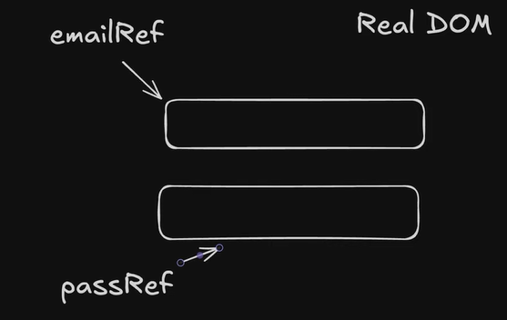

# Problem:
function Login(){
    const[email,setEmail]=useState("");
    const[password,setPassword]=useState("");
    console.log("render");
.
.
.
}
Short description : The problem of uncontrolled and controlled components, how natively browser and react manages states of input fields

Description: 
1. How the Browser Natively Manages Input Fields

Before React or any JavaScript framework exists, the web browser (Chrome, Firefox, Safari) has its own built-in mechanism for handling text inputs.
The Browser's Internal State.
When you render a standard HTML <input type="text" />, the browser treats it as an independent, self-contained piece of UI. The browser maintains its own internal state for that input hidden deep within the DOM (Document Object Model).

When a user clicks into an input field and presses the "A" key:

    The hardware keyboard sends a signal to the operating system, which passes it to the browser.

    The browser’s internal rendering engine updates its own memory layout for that specific DOM node.

    The browser instantly repaints that tiny section of the screen to show the letter "A".

Crucially, this entire process happens outside of JavaScript. The browser manages the cursor position, text selection, deletes, and additions entirely on its own. JavaScript can listen to these changes via events (like oninput or onchange), but JavaScript does not need to give permission for the text to appear. The DOM is the sole "source of truth" for that data.

2. The Controlled Component Approach (The Problem Setup)

When you use useState to manage an input, you are telling React to strip the browser of its natural capabilities and hand total control over to React. This is called a Controlled Component.
The Re-rendering Chain Reaction

In a controlled component, the React state becomes the absolute "source of truth." The browser is no longer allowed to decide what text is inside the input box. Instead, a strict, cyclical chain reaction occurs every single time you press a key:

    The User Types: The user types the letter "S" into the Email field.

    The Interception: Because you have an onChange handler, React intercepts this keystroke event.

    The State Update Request: Your code calls setEmail(e.target.value). This tells React, "Hey, I want to update the state variable email to 'S'."

    The Trigger: Updating state tells React that the component's data has changed. React schedules a re-render.

    The Re-render (The Bottleneck): React executes the entire Login() function from the very first line to the last line. This is why console.log("render") fires. React builds a new Virtual DOM tree to see if anything else in your UI needs to change.

    The DOM Sync: React calculates the difference, goes to the actual browser input, and explicitly sets its .value property to "S".

If you type an email like user@example.com (16 characters), this entire 6-step cycle executes 16 separate times. For a simple login form, forcing JavaScript to recalculate the entire component layout 16 times just to display text on a screen is massive overkill and causes the excessive rendering you observed.

Solution: 

Short description: we give control to browser for managing my input fields rather than react.

Description:
The Uncontrolled Component Approach (The Solution Setup)

When you switch to useRef, you change the architecture to an Uncontrolled Component. You are essentially telling React, "Step back. Let the browser handle the typing natively, and I will just grab the final result when I need it."
How useRef Bypasses the React Lifecycle

A useRef hook creates a permanent, mutable JavaScript object { current: ... } that persists for the entire lifespan of the component.

    The DOM Attachment: When you write <input ref={emailRef} />, React mounts the element to the screen once. During this mount, React takes the actual, physical browser DOM element and assigns a reference to it inside emailRef.current.

    Native Browser Management: Now, when the user types user@example.com, the browser handles it natively using its internal state (as described in Section 1).

    No State, No Re-renders: Because there is no useState setter being called on every keystroke, React is completely unaware that the user is typing. Because React doesn't know (and doesn't care), it has no reason to re-render the component. The Login() function executes exactly once (when the page first loads) and never again during the typing process.

Reading Data "Pull" vs. "Push"

    Controlled (useState) pushes data into React's memory on every single keystroke, forcing constant updates.

    Uncontrolled (useRef) leaves data in the browser's memory. When the user finally clicks the "Submit" button, your handleSubmit function reaches directly into the browser's DOM via emailRef.current.value and pulls the final text out all at once.

Solution-syntax: using useRef:

const emailRef = useRef("");
const passRef = useRef("");

<form onSubmit={handleSubmit}>
            <input ref={emailRef}></input>
            <input ref={passRef}></input>
            <button  type="submit">Submit</button>
</form>

Simply:
