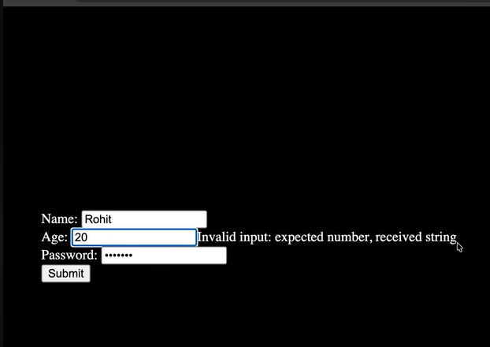

Problem1:
Browser automatically converted the input of any type to string.

solution:
const formSchema = z.object({
    
    age: z.number().min(10, "Age should be greater than 10").max(80,"Age should be less than 80"),
    
});

change this to:
const formSchema = z.object({
    
    age: z.coerce().number().min(10, "Age should be greater than 10").max(80,"Age should be less than 80"),
    
});